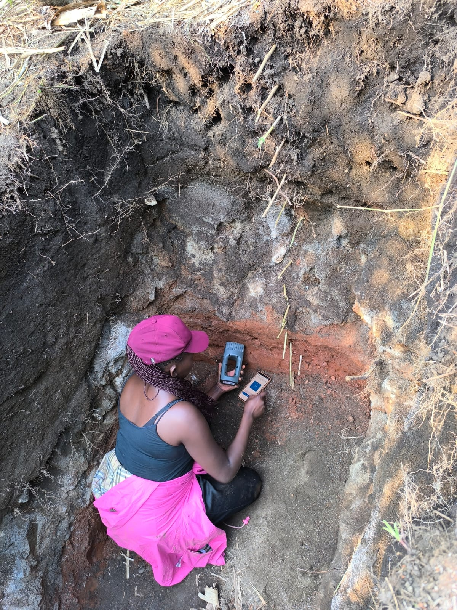
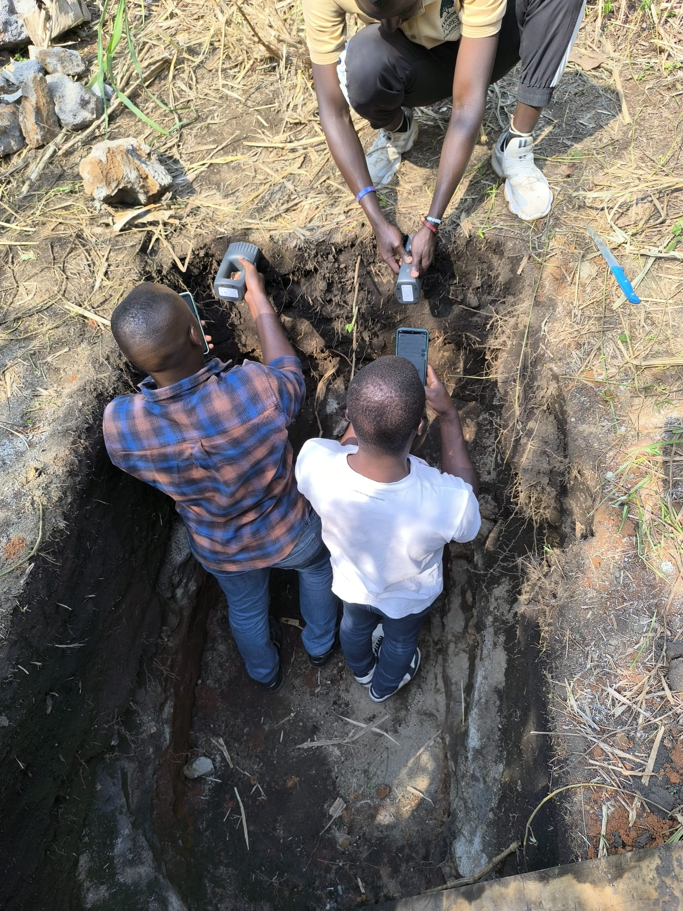
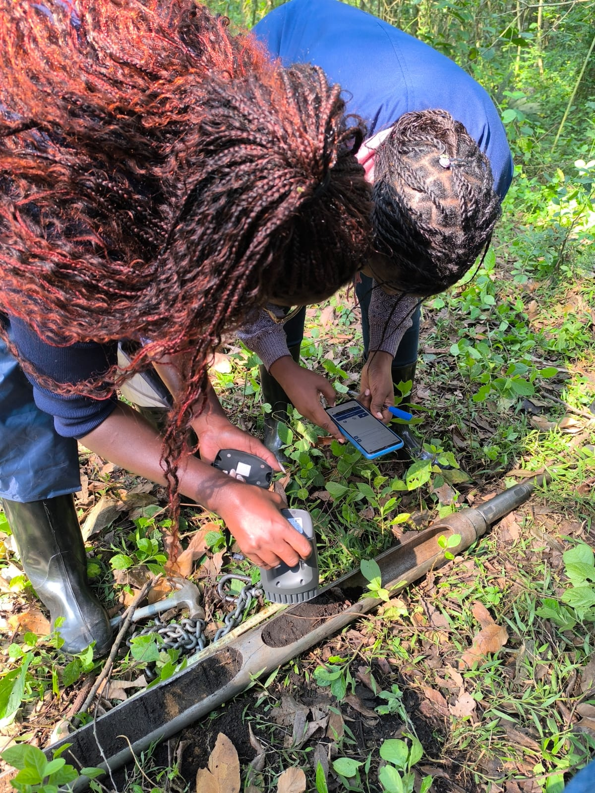

__TROPIRES Summer School Uganda August 19–23 2024__
================

Cost-efficient spectroscopy for soil analyses
================

*Leonardo Ramirez-Lopez, Moritz Mainka, Laura Summerauer*

# __The workshop__

This is the main repository of the workshop II entitled "__Cost-efficient spectroscopy for soil analyses__".

The main objective of our workshop was to immerse students in a practical experience where they could grasp the principles, benefits, and limitations of soil spectroscopy. To achieve this, we concentrated on the use of __handheld sensors__. The students developed their own predictive models using __open-source software__ and by utilising __existing soil NIR databases__. These models were then uploaded into a handheld system. Afterwards, they went into the field to carry out real-time estimations of the carbon content across soil profiles.

    
    
    

# __Our learning objectives__

- Understand NIR and IR Spectroscopy and soil spectral libraries

- Evaluate capabilities and limitations

- Gain hands-on experience with portable spectroscopy and estimations

- Interpret spectral data for soil management

- Dive into the Data Science aspects required for soil spectroscopy (with R)

# __In this repository__

- The core slides using during the workshop are in the folder `slides_presentations/`

- The core functions and examples are in the folder `R/`. Here you will also find the instructions on how to install the R library `proximater`which was intensively used during the workshop (see `install_proximater.R`). 

- The main data are in the folder `data/`

- The data generated by the students are in the folder `data/00output`
